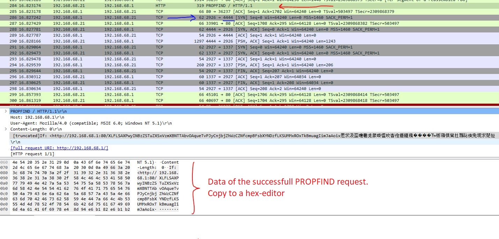
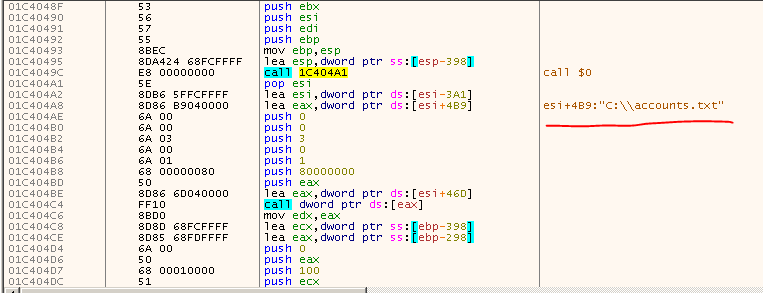

# 7-re_crowd  
This challenge is just a PCAP file. At the first open it in the Wireshark and we see some HTTP GET requests and responses.  
  

Open it in the ```NetworkMiner``` software to extract the content of this pcap file. To import the dump to Networkminer, you must convert it to a .pcap file. Ok now NetworkMiner, gives us a html file and some pictures. When you open the html file, you see a site like a forum that some people chatted on and if you read them you find that a password file is stored in the ```C:\Accounts.txt``` file.  
Ok but this is not enough for this challenge and there isn’t any other useful data for us.  
Now if we look at the dump again in the Wirershark we see that the some unusual HTTP requests has been sent too the server(```192.168.68.1```) and the server answerd these request with ```Internal Service failure```.  
If you search ```PROPFIND``` in the Google you find that this is a tag of ```WebDAV``` protocol.  
```WebDAV``` is a extension of ```HTTP``` that allows the clients to do some operations like move and change files data ,on a server.  
So probably we have an remote attack here. If you search WebDAV vulnerabilities, you find a related vulnerability that is a RCE type. This vulnerability is in the ```IIS6.0```.   
For more details:[CVE-2017-7269](https://www.trendmicro.com/en_us/research/17/c/iis-6-0-vulnerability-leads-code-execution.html)    
I found a python script for this vulnerability from exploitdb.com and found it is like those data in the dump.  
[shellcode][https://www.exploit-db.com/exploits/41738]  

If you scroll down the pcap dump file, after some ```PROPFIND``` requests, and failure responses, a PROPFIND request is sent and then a connection is stablished on the ```4444``` port on ```192.168.68.21```. the ```4444``` is for ```Metasploit```.  
The exploit mechanism in the ```Metasploit``` is in this way that start sending some junk data with different size plus the shellcode, to the server until one of them successfully runs and can connect back to the attacker 4444 port. So the previous failed requests are those requests which the size of junk data isn’t enough to exploit the service. But the last one is the correct attack vector(the 284th packet in the dump). So we can use this packet for our shellcode.  
  

I used this packet, and replace its data with those bytes that is in the downloaded script from exploit-db. Look at sc.py file.  
Now it is time to gets your hand dirty and dive in the exploit.  
The vulnerability is in the ```IIS6.0``` and you could find it on ```Windows server 2003```.  You can download the vulnerable version from here.[linkofwinserver].  
Install windowns-server 2003 in a VM and active IIS service and WebDAV. Change its IP to ```192.168.68.1```. now the server machine is ready.  
### Tip: You must set your server IP to 192.168.68.1 and your attacker IP to: 192.168.68.21.   
Ok now you can run the attack script and exploit the server. But before run the script, you should open the 4444 port on your machine in listen mode. I used netcat for this job:
```nc -lvvp 4444```  
Now when you run the script, you should see a connection comes to 4444 port.  
  

As you see, we have just a connection from server to 4444, but what should we do at the moment? When you send some chars to the server you see that the connection will close. So what is the next step?  
Let’s look at the dump again:  
After that connection is stablished, the attacker sends 1297 bytes data to the server and then a new connection is opened on 1337 port of attackers system And after that 260 bytes comes to the attacker system from the server and connection is closed.  
When you look at those bytes that has sent to the server from 4444, you see some encrypted data. So we  
Don’t now what is these data.what should we do at this moment? OK, I thought that we don’t need know what is these data, we can send exactly the encrypted data to the server, when the connection established on 4444. For this propos I used the netcat to listen on 4444 and when the connection is stablished, immediately it sends those 1297 bytes to the server. On other hand I setup another netcat to listen on 1337.  
```echo -e -n "those 1297 bytes"|nc -lvvp 4444```
And  
``` nc –lvvp 1337```  
Now run the script and we see that a connection is stablished on 1337 but there isn’t any data. So when those 260 bytes which had come from the server to the 1337, will recive?  
OK at this point I debugged the ```WebDAV``` servie on the server to see what happened there  .
For debugging the service you should know that an executable file runs in the windows-server for response to the WebDAV requests. The name of this process is ```w3wp.exe``` and  by default this process isn't run in the server. so you have to run one time the script, to start this executable and after that you should attach the debugger to this executable.  
I used x64dbg and attach it to ```w3wp.exe```. Now we know that the shellcode runs and create a connection on remote 4444 port and then if receves 1297 of bytes(that we don't know what is these bytes) it creates another connection on the 1337 remote port. So I set a bp on the ```socket``` function to know when and where the 1337 socket will create.  
Now i setup my attacker OS:  
``` 
$echo "those 1297 bytes"|nc -lvvp 4444
$nc -lvvp 1337
$python sc.py
```  

Now we see that on the server side, the debugger breaks at the ```socket``` function.  
 Trace the ```w3wp``` and after that the socket function is finished, We see a string in the debugger :```C:\\accounts.txt``` so we are in the shellcode at the moment  
  
You could dump it and analyze the dump in the IDAPro. This code reads the C:\accounts.txt file from the server, encrypts it with a the xor algorithm and then sends these data to 1337 on the attacker system. So those 297
